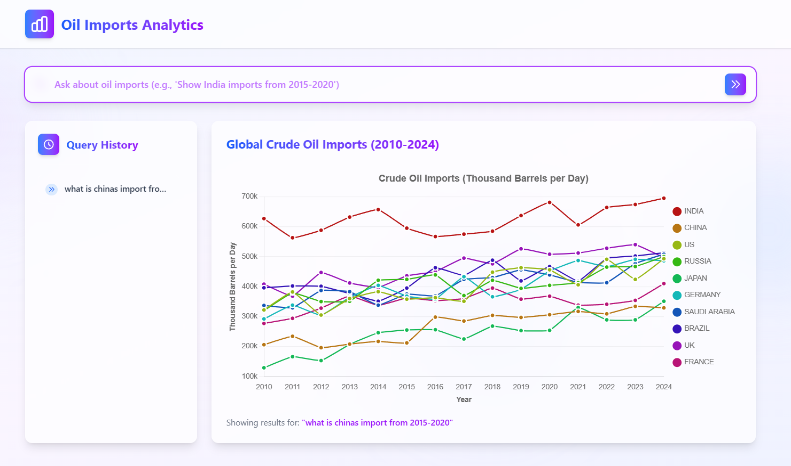

# Oil Imports Analytics Dashboard

## Features ✨

- **Natural Language Search** - Query data using everyday language
- **Smart Suggestions** - Get relevant query recommendations as you type
- **Interactive Charts** - Visualize data with dynamic, responsive charts
- **Query History** - Easily access previous searches
- **Modern UI** - Clean, glass-morphism design with smooth animations

## Tech Stack 🛠️

- **Frontend**: React.js
- **State Management**: Redux
- **Styling**: Tailwind CSS
- **Charts**: Chart.js
- **Icons**: Heroicons

## Installation ⚙️

1. Clone the repository: git clone https://github.com/Alroy05/data-query-dashboard.git

2. cd oil-imports-dashboard

3. npm install

4. npm start
  